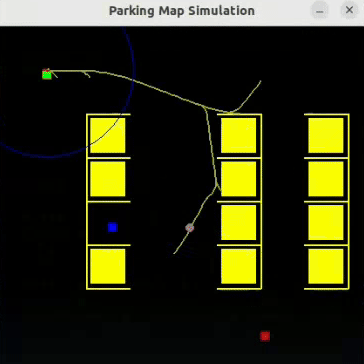
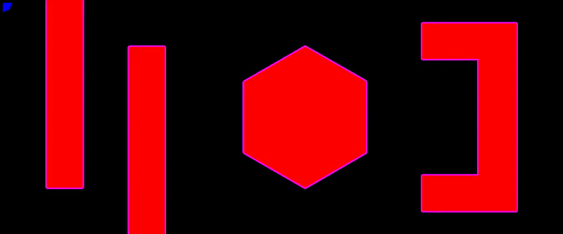

# Path Planning Algorithms

## Repository Information
📌 **GitHub Repository:** [Project Repository](https://github.com/KomK2/ENPM661)  
📌 **Branches:**
- **Dijkstra Algorithm:** `project2`
- **A* Algorithm:** `hotfix/3-2`

📌 **Additional Repository for RRT Implementation:**  
🚀 **RRT Algorithm Repository:** [RRT Repository](https://github.com/KomK2/RRT.git)

---
## 🚀 Watch the A* Algorithm in Action on Gazebo!*

🎥 A Gazebo Simulation Video:[Click Here](https://drive.google.com/file/d/1XC33JDitWcm1zKLBANkaWhPLNr_Pvb2O/view?usp=drive_link)


## Overview
This project implements three path planning algorithms:

✅ **Dijkstra's Algorithm** - Finds the shortest path between a start and goal node using uniform cost search.
✅ **A* Algorithm** - An optimized version of Dijkstra’s algorithm that uses heuristics for faster convergence.
✅ **Rapidly-exploring Random Tree (RRT) Algorithm** - Implemented separately in [this repository](https://github.com/KomK2/RRT.git), which is useful for high-dimensional and complex spaces.

Both Dijkstra and A* implementations account for obstacles and robot clearance and provide visualizations of node exploration and the optimal path.

For RRT, refer to the **[RRT Repository](https://github.com/KomK2/RRT.git)** for details on its implementation.

---

## Dependencies
The following Python libraries are required to run the code:
```bash
numpy, cv2, math, queue, matplotlib.pyplot, matplotlib.path
```
Ensure these libraries are installed before executing the code.


---

## Running the Algorithms


### 🚀 Running RRT Algorithm
For RRT implementation, please visit the **[RRT Repository](https://github.com/KomK2/RRT.git)**. This algorithm is particularly useful for high-dimensional and complex environments.



---

### 🚀 Running Dijkstra’s Algorithm
1. Run the script:
   ```bash
   python project2/dijkstra_kiran_abhinav.py
   ```
2. Enter the **X and Y coordinates** for the start and goal nodes.
3. Enter the **clearance** for the robot.
4. The algorithm will compute the optimal path and display the results on the map.
5. A **video** of the exploration and final path will be generated and saved.

🎥 **Dijkstra Video Demo:** [Click Here](https://drive.google.com/file/d/1XC33JDitWcm1zKLBANkaWhPLNr_Pvb2O/view?usp=drive_link)


---

### 🚀 Running A* Algorithm
1. Switch to the hotfix/3-2 branch:
   ```bash
   git checkout hotfix/3-2
   ```
2. Run the script:
   ```bash
   python project3/a_star_kiran_abhinav.py
   ```
3. Enter the **X and Y coordinates** and **orientations** of the start and goal nodes one by one.
4. Ensure orientations are **multiples of 30 degrees**.
5. Enter the **clearance** of the robot.
6. The optimal path will be displayed on the map.
7. A **video** with Node Exploration and Optimal Path will be saved.

Example:
- **Start Node:** (200, 200, 60)
- **Goal Node:** (5500, 200)
- **Clearance:** 150mm

🎥 **A* Video Demo:** [Click Here](https://drive.google.com/file/d/1MEY6ymRR-24Ugi8W5W1CLPFNxZ5jtnar/view?usp=drive_link)


---

## ROS2 Implementation (For A* Algorithm Only)

### 📌 Setting Up and Running
1. Copy the given package into the ROS2 workspace.
2. Navigate to the package directory and build the workspace:
   ```bash
   colcon build
   source install/setup.bash
   ```
3. Launch the ROS2 package:
   ```bash
   ros2 launch turtlebot3_project3 competition_world.launch.py
   ```
4. Run the A* ROS2 node:
   ```bash
   ros2 run turtlebot3_project3 path_plan.py
   ```
5. Enter the goal coordinates in **X and Y**.

Example:
- **Goal Coordinates:** (4500, 200)

---

## 📂 Branch Information
Make sure to switch to the correct branch before running the respective implementations:
```bash
git checkout project2  # For Dijkstra Algorithm
git checkout hotfix/3-2  # For A* Algorithm
```

For RRT, refer to its dedicated repository: **[RRT Repository](https://github.com/KomK2/RRT.git)**.

---

## 📚 References
- ENPM 661 - Planning for Autonomous Robots
- ROS2 Documentation
- Rapidly-exploring Random Tree (RRT) Planning

For any queries, please reach out via GitHub issues or email. 🚀

